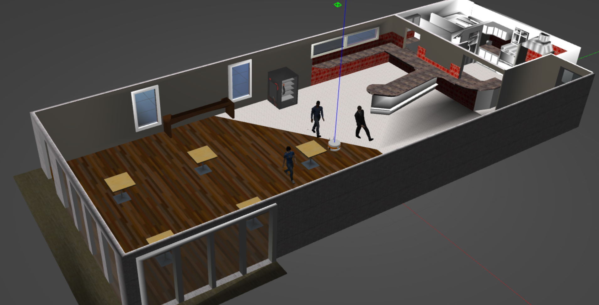
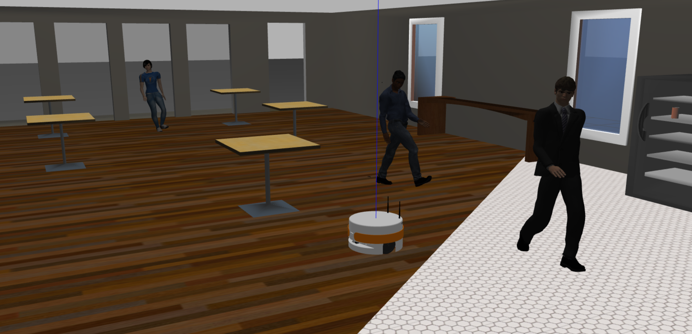
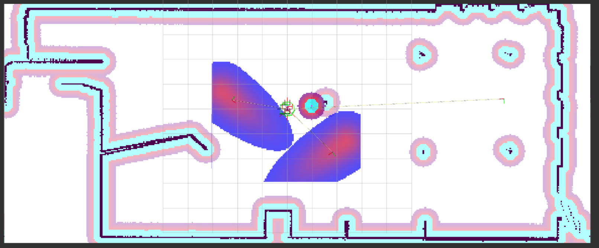

# Human-Aware Service Robot

A ROS2-based human-aware navigation project where a mobile service robot autonomously moves inside a café environment while avoiding obstacles and pedestrians in real time.

The project uses:

* ROS2
* Gazebo
* Nav2
* HuNav Sim (Human Navigation Simulator)





# Features

* Autonomous navigation in a café environment
* Human-aware path planning
* Dynamic obstacle avoidance
* Integration with Nav2 social costmaps
* Human tracking through `/people` topic
* Configurable navigation parameters and social distances

# Workspace Structure

Important project files:

```bash
/hunav_ws/src/hunav_gazebo_wrapper/launch/simulation.launch.py
/hunav_ws/src/hunav_gazebo_wrapper/scenarios/agents_cafe.yaml
/hunav_ws/src/hunav_gazebo_wrapper/launch/pmb2_params/pmb2_nav_public_sim.yaml
```

## Key Files
### `simulation.launch.py`

Main simulation launcher.

Responsible for:
* launching Gazebo
* spawning the robot
* loading the café environment
* launching Nav2
* launching HuNav agents

### `agents_cafe.yaml`

Defines human agents in the café:

* number of pedestrians
* trajectories
* behaviors
* goals
* motion parameters

### `pmb2_nav_public_sim.yaml`
Navigation Behavior

Main Nav2 configuration file.

* obstacle avoidance
* social distances
* inflation radius
* local planner behavior
* costmaps
* navigation parameters
* robot speed and safety margins


# Build Instructions

## Build only HuNav Gazebo wrapper

```bash
cd ~/hunav_ws

colcon build --packages-select hunav_gazebo_wrapper

source install/setup.bash
```

# Full Clean Rebuild

Use this when:

* Gazebo worlds are corrupted
* generated worlds are outdated
* launch problems appear
* Nav2 configuration changes are not detected

```bash
cd ~/hunav_ws

rm -rf build install log

colcon build --symlink-install

source install/setup.bash
```


# Cleaning Gazebo and ROS Processes

Before relaunching the simulation, clean old processes:

```bash
killall -9 gzserver gzclient rviz2 2>/dev/null
pkill -f hunav 2>/dev/null
pkill -f ros2 2>/dev/null
```

---

# Removing Generated Worlds

Locate generated worlds:

```bash
find ~/hunav_ws -name generatedWorld.world
```

Remove generated world:

```bash
rm /home/ambroise/hunav_ws/install/hunav_gazebo_wrapper/share/hunav_gazebo_wrapper/worlds/generatedWorld.world
```

Or:

```bash
rm <path>
```


# Launch Simulation

## Launch café environment

```bash
ros2 launch hunav_gazebo_wrapper simulation.launch.py environment_name:=cafe
```


## Default launch

```bash
ros2 launch hunav_gazebo_wrapper simulation.launch.py
```

# Human Tracking

The project publishes detected humans on:

```bash
/people
```

## Verify topic

```bash
ros2 topic list | grep people
```


## Read one message

```bash
ros2 topic echo /people --once
```

Example output:

```yaml
header:
  frame_id: map
people:
- name: agent1
  position:
    x: 0.90
    y: -2.73
  velocity:
    x: -0.003
    y: -0.002

- name: agent2
  position:
    x: -2.19
    y: -0.62
  velocity:
    x: -0.24
    y: -1.92
```

The `/people` topic provides:

* pedestrian positions
* velocities
* behavior IDs
* tracking reliability
* social context information


# Navigation Tuning

Main configuration file:

```bash
~/hunav_ws/src/hunav_gazebo_wrapper/launch/pmb2_params/pmb2_nav_public_sim.yaml
```

To modify:

* social distances
* obstacle inflation
* planner tolerances
* local planner parameters
* robot velocity limits
* costmap behavior
* pedestrian avoidance behavior

After modifications:

```bash
cd ~/hunav_ws

colcon build --packages-select hunav_gazebo_wrapper

source install/setup.bash
```

Or perform a full rebuild:

```bash
cd ~/hunav_ws

rm -rf build install log

colcon build --symlink-install

source install/setup.bash
```

